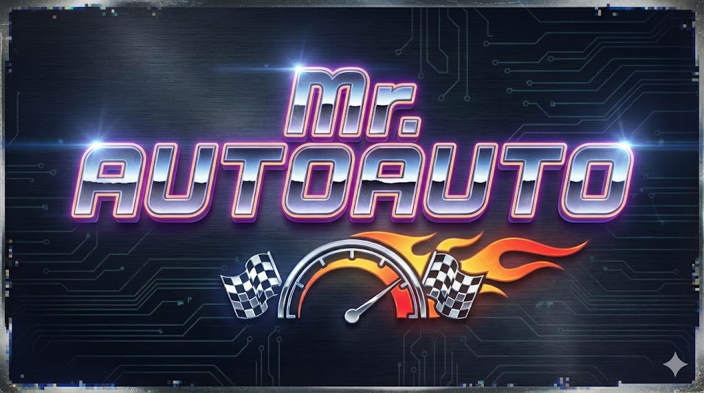

# Mr. Autoauto


Mr. Autoauto is a 2.5D hill-climb combat prototype built with Rust + Bevy.
You drive over deforming terrain, fight enemy waves, collect drops/upgrades, and get dual-commentator narration/subtitles (with optional Neocortex chat+voice API integration).

## Status

Active prototype with:
- Rapier-based vehicle/enemy physics
- Gun + missile combat
- Enemy spawning and scoring/stunt tracking
- Upgrade offers during runs
- SFX mix layer and commentator subtitles/voice
- Gaussian splat background support (feature-gated)

## Requirements

- Rust toolchain `1.88.0` (see `rust-toolchain.toml`)
- A GPU/driver setup that can run Bevy 0.17

## Run

```powershell
cargo run --release
```

Gaussian splats are enabled by default via the `gaussian_splats` feature.
If you want to run without that feature:

```powershell
cargo run --release --no-default-features
```

## Controls

- `D` / `Right`: accelerate (or choose right upgrade card)
- `A` / `Left`: brake/reverse (or choose left upgrade card)
- `Esc`: pause/resume
- `R`: open results
- `Enter`: pause -> results
- `Space`: results -> new run
- `Q`: quit from results
- `H`: toggle keybind help panel
- `O`: toggle debug text overlays
- `V`: toggle vehicle tuning panel
- `B`: toggle background tuning panel
- `I` / `P`: debug camera pan left/right
- `F5`: hot-reload config files from `config/`
- `N`: dump loaded vehicle model scene info to log
- `J` / `K` / `C`: queue debug commentary events

## Configuration

Main tuning lives in `config/*.toml`:
- `config/game.toml`: app flags, terrain waves, scoring, SFX mix, run upgrade pool
- `config/vehicles.toml`: vehicle physics, traction/suspension, health, targeting
- `config/weapons.toml`: projectile and weapon tuning
- `config/enemy_types.toml` + `config/spawners.toml`: enemy stats and spawn rules
- `config/backgrounds.toml` + `config/environments.toml`: segment/background/environment setup
- `config/commentator.toml`: commentator rotation, emotions, API behavior
- `config/assets.toml`: model/sprite/splat/audio asset mappings

In-game tuning panels (`V` and `B`) can write selected values back to TOML.

## Neocortex Commentary API (optional)

1. Enable API in `config/commentator.toml`:

```toml
[commentary]
api_enabled = true
```

2. Set environment variables before launch:

```powershell
$env:NEOCORTEX_API_KEY="your_key_here"
$env:NEOCORTEX_API_BASE_URL="https://neocortex.link" # optional
```

When API is disabled or unavailable, the game falls back to local commentary lines.

## Development

```powershell
cargo check
cargo clippy --all-targets --all-features
cargo test
```

## Credits

Includes SFX samples from zangrutz, hykenfreak, qubodup, kenny1007, sieuamthanh, madpancake, poundsounduk and debsound. Music from zagi2.
